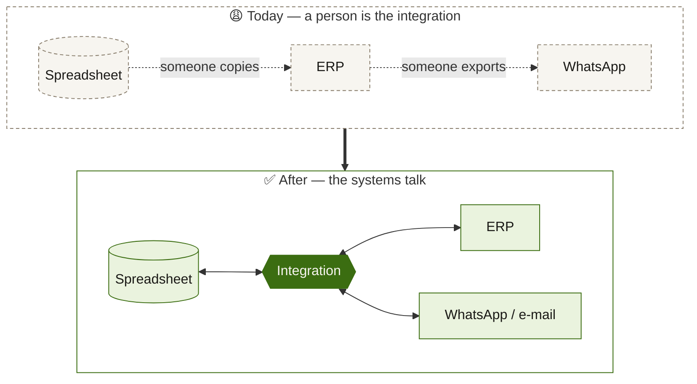

<picture>
  <source media="(prefers-color-scheme: dark)" srcset="./assets/banner-dark.svg">
  
</picture>

<p align="center">
  <a href="https://cordeirolima.net"></a>
  <a href="https://www.linkedin.com/in/pedro-cordeiro/"></a>
  <a href="mailto:pedro@cordeirolima.net"></a>
</p>

<br>

Most of the software I touch doesn't fail because of bad code — it fails because **two systems that should talk to each other don't**, and a person ends up being the integration layer. I'm a backend developer who likes fixing exactly that.

```yaml
# ~/now.yml — what I'm up to (Oct 2026)

day_job:
  at:   Bosch
  what: conversational AI — building chatbots on Cognigy

building:
  at:   Stako  # co-founder
  what: a website factory — Astro + Directus per client, Neon Postgres, Cloudflare

freelance:
  at:   Cordeiro Lima
  what: connecting the isolated systems of small businesses with no in-house IT

based_in: Hortolândia, SP — Brazil
open_to:  backend & integration projects
```

### 🔌 How I think about it



### 🧰 Toolbox

<p>
  
</p>

<sub>Also in the daily rotation: Directus · Drizzle · Clerk · Railway · n8n · Cognigy</sub>

### 🏢 Been around

**IBM** · **Claro** · **Greenbrier Maxion** · **Bosch**

<sub>Years of enterprise systems integration — now applied to companies that don't have an IT department.</sub>

<br>

<p align="center">
  <sub><i>“Seus sistemas deveriam conversar entre si.”</i></sub>
</p>
